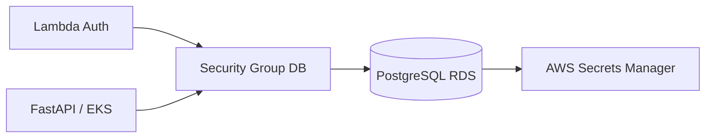

# Oficina Database Infra

Provisiona PostgreSQL gerenciado em Amazon RDS usando Terraform, com storage criptografado, backup, Performance Insights, rede privada e credenciais armazenadas no AWS Secrets Manager.

## Stack

Terraform, Amazon RDS for PostgreSQL, AWS Secrets Manager e AWS VPC.

## Arquitetura específica

## Pré-requisitos

Receber da infraestrutura Kubernetes:

- `VPC_ID`
- `PRIVATE_SUBNET_IDS`
- `VPC_CIDR`

Também utiliza o bucket S3 compartilhado de state remoto.

Variáveis GitHub:

- `AWS_REGION=us-east-1`
- `TF_STATE_BUCKET=<bucket criado pelo bootstrap>`
- `TF_STATE_READY=true`
- `VPC_ID=<output do repo k8s>`
- `PRIVATE_SUBNET_IDS=<JSON dos outputs do repo k8s>`
- `VPC_CIDR=<output do repo k8s>`
- `ENABLE_DEPLOY=true` somente quando o deploy estiver autorizado

Secrets GitHub:

- `AWS_ACCESS_KEY_ID`
- `AWS_SECRET_ACCESS_KEY`

## CI/CD

Pull Requests validam o Terraform. Push/execução manual autorizada cria RDS, Security Group, DB Subnet Group e o secret `oficina/<env>/database`.

O Summary do pipeline publica endpoint, ARN do secret e Security Group ID sem exibir senha.

## Modelo de dados

O banco suporta `customers`, `service_orders` e `order_status_history`. O histórico de status permite calcular o tempo médio em cada etapa da OS.

Veja também a documentação consolidada:
https://github.com/YasminLuna/oficina-api/blob/hml/docs/RFC-002-MODELO-DADOS.md

## Swagger / Postman

Este repositório não expõe API própria. A coleção da demonstração está em:
https://github.com/YasminLuna/oficina-api/blob/hml/postman/Oficina-Fase3.postman_collection.json
