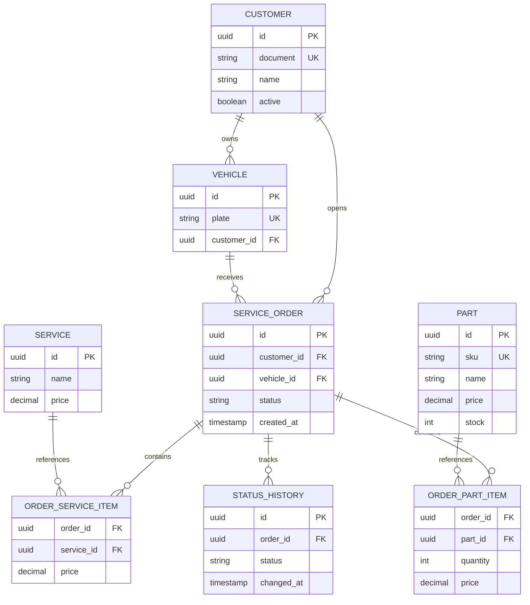

# Modelo Entidade-Relacionamento

## Justificativa
PostgreSQL foi mantido por oferecer integridade referencial, transações ACID, índices, constraints e boa aderência ao domínio relacional da oficina. Em cloud, RDS reduz a carga operacional ao fornecer backups, monitoramento e manutenção gerenciada.
